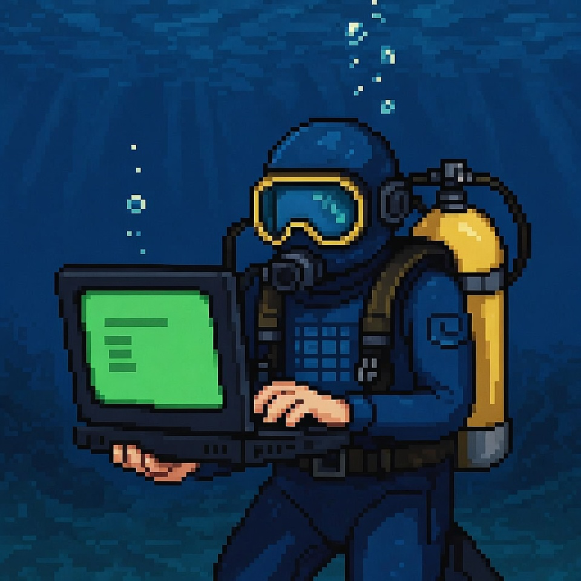
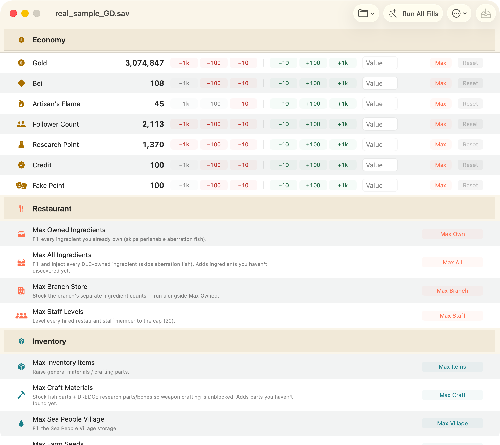
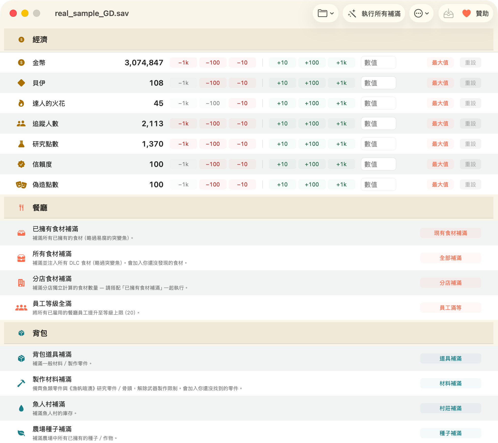
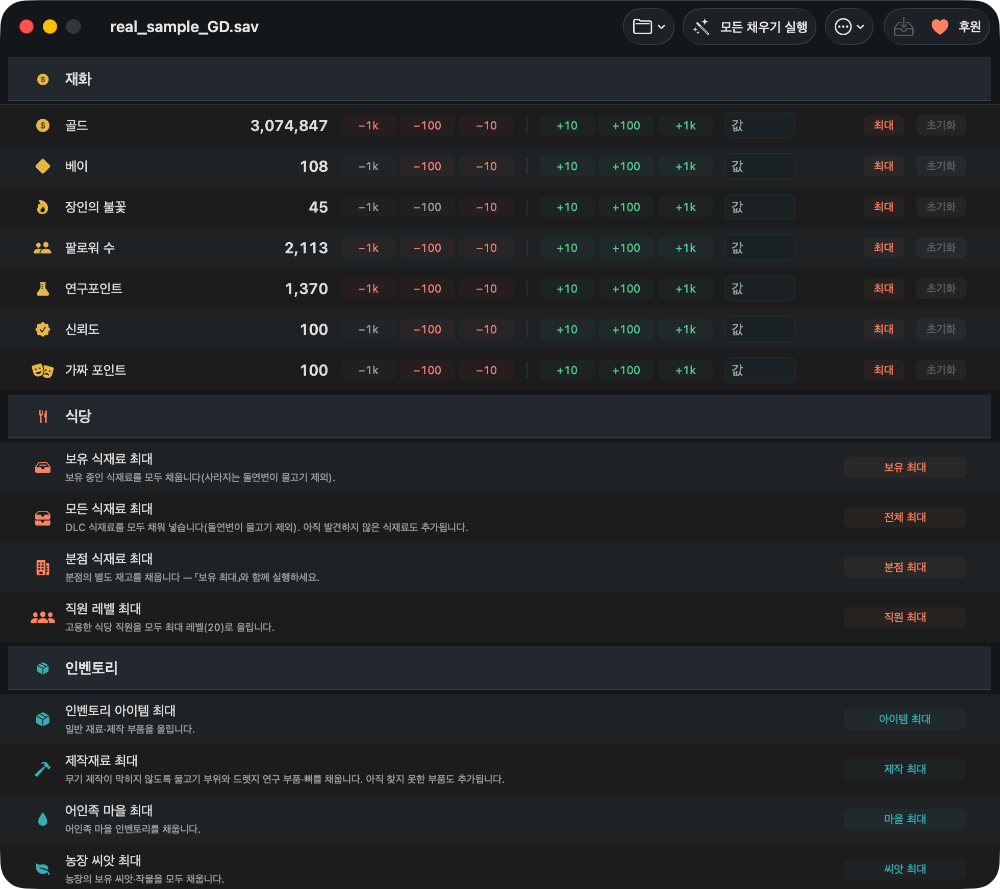

<p align="center">
  
</p>

<h1 align="center">DiveSaveEd — macOS 版《潛水員戴夫》存檔修改器</h1>

[English](README.md) · [简体中文](README.zh-Hans.md) · **繁體中文** · [한국어](README.ko.md)

[](LICENSE)
[](#requirements)
[](#requirements)

**專為《潛水員戴夫》(Dave the Diver) 打造的原生 macOS 存檔修改器。** 這款遊戲的存檔修改器幾乎清一色
只支援 Windows — 而這是一款真正的 Mac 軟體：開啟存檔、修改、關閉，就這麼單純。不需要 Wine、不用
Cheat Engine、不注入遊戲程序、不需要帳號、不連網路。

<p align="center">
  
</p>

> **經 Apple 簽署與公證**，每個版本都會發布 SHA-256 與 GitHub build provenance 證明。開啟前可以自己驗:
>
> ```bash
> shasum -a 256 DiveSaveEd-macOS-v1.0.1.dmg     # 跟 release 頁面比對
> spctl -a -t open --context context:primary-signature -v DiveSaveEd-macOS-v1.0.1.dmg
> ```

## 系統需求

macOS 14 或以上版本，支援 Apple Silicon 與 Intel。適用於 macOS 上的 **Steam** 版遊戲。

> **DiveSaveEd 不是 DaveSaveEd。** 兩者名稱只差一個字母，也都在改這款遊戲的存檔，但 DiveSaveEd 是
> 用 Swift 寫的 macOS 程式，DaveSaveEd 是 Windows 工具。這個在 Windows 上不能執行。

> **不支援** Nintendo Switch 與 PlayStation 的存檔 — 那些是主機端存檔，本工具無法讀取。

## 安裝

從 [Releases](../../releases/latest) 下載最新的 `.dmg`，再把程式拖進「應用程式」資料夾。

本程式已經過 Apple 簽署與公證，可以正常開啟 — macOS 只會在第一次執行時，顯示例行的「從網路下載」
確認訊息。

## 功能

**貨幣** — 金幣、貝伊、達人的火花、研究點數、COOKSTA 追蹤人數、信賴度與偽造點數。可以 ±10／100／1000
增減、直接輸入指定數值，或設為最大值。「重設」會把數值還原成你開啟存檔時的狀態。

**批次補滿** — 每一項各按一下，或用 **執行所有補滿** 一次搞定：

| | |
|---|---|
| 餐廳 | 已擁有食材 · 所有食材（自動判斷 DLC） · 分店庫存 · 員工等級 |
| 背包 | 一般道具 · 製作材料（魚類零件＋《漁帆暗湧》研究零件／骨頭） · 魚人村 · 農場種子 · 已捕魚類等級 |

**依名稱瀏覽並修改任何單一道具** — 程式內建道具資料庫，你可以直接搜尋真正想要的東西，不必去猜數字 ID。

**所有操作都能還原** — 每個批次操作都可以在程式內還原，每次寫入前都會先建立帶時間戳記的備份，並提供
回復介面讓你回到其中任何一份。

**唯讀的原始存檔檢視器** — 以格式化 JSON 搜尋整份解碼後的存檔。這裡刻意設計成唯讀：手動修改原始數值
可能讓進度旗標的順序錯亂，導致該周目卡死無法繼續。

**多重存檔格** — 自動抓出遊戲的每一份存檔，讓你自由選擇。

**四種語言** — English、简体中文、繁體中文、한국어。沒有你的語言？補上一個語系靠的是一份試算表，不是寫程式 —— [見下方](#致謝)。

<p align="center">
  
  
</p>

## 《潛水員戴夫》Mac 存檔位置在哪裡？

《潛水員戴夫》在 macOS 上的存檔放在這裡：

```
~/Library/Application Support/com.nexon.dave/SteamSData/<steam-id>/
```

有些安裝方式則會改用這個路徑：

```
~/Library/Application Support/nexon/DAVE THE DIVER/SteamSData/
```

兩個位置都會自動檢查 — 不必告訴程式存檔在哪，它自己就找得到。檔案名稱會是 `GameSave_XX_GD.sav`。

`~/Library` 在 Finder 中是隱藏的。想自己打開的話：**Finder → 前往 → 前往檔案夾…**（`⇧⌘G`），貼上
路徑後按 Return。

## ⚠️ Steam Cloud 會默默還原你的修改

這是修改「沒有生效」最常見的原因。Steam 啟動時一發現本機存檔和雲端版本不一致，就會在遊戲載入之前
**用舊的雲端存檔蓋掉你的修改**。請照這個順序操作：

1. **完全關閉《潛水員戴夫》。** 遊戲執行中時，本程式會拒絕寫入。
2. **關閉這款遊戲的 Steam Cloud** — Steam 媒體庫 → 在 **《潛水員戴夫》** 上按右鍵 →
   **內容** → **一般** → 取消勾選 **在 Steam Cloud 保留遊戲存檔**。
3. **修改並儲存。** 程式會自動先寫入一份帶時間戳記的備份。
4. **啟動遊戲。** 這時載入的就是你修改後的版本了。

## 常見問題

### 用了這個工具會被封鎖帳號嗎？

不會。《潛水員戴夫》是單人遊戲，沒有多人連線、沒有排行榜，也沒有任何反作弊軟體。本工具只是在遊戲
關閉時，修改你自己電腦上的一個檔案。它不會附加到遊戲程序，不會讀寫遊戲記憶體，也不會動到遊戲執行檔。

### 為什麼啟動遊戲後，我的修改就不見了？

幾乎都是 Steam Cloud 造成的 — 請看上面那一節。另一個原因是開場教學：教學期間有少數數值是寫死在
腳本裡的，遊戲會直接覆蓋掉。只要過了那個階段，修改就會穩穩保留。

### 中文、韓文或日文的存檔也能用嗎？

可以。含有非 ASCII 文字的存檔都能正確讀取與寫入，不會出現亂碼。

### Intel 版 Mac 能用嗎？

可以 — 本程式是同時支援 Apple Silicon 與 Intel 的通用版本。

### 支援《叢林》DLC 嗎？

部分支援，這個限制值得先知道。裝了 DLC 的存檔可以正常讀取與寫入 —— 程式不認識的內容會原封不動
保留 —— 而批次補滿也只會注入存檔中回報為已安裝的 DLC 內容。但內建的道具資料庫早於《叢林》,
所以《叢林》專屬的道具不會列出名稱，也不在批次補滿的範圍內。更早的 DLC(包含《漁帆暗湧》聯名)
都有涵蓋。

### 不小心做錯了，可以還原嗎？

可以，而且有兩道保險：**還原上一次修改** 讓你在真正寫入之前，就先在程式內還原批次操作；此外每次寫入
都會建立帶時間戳記的備份，可以從 **從備份回復** 視窗挑一份回復。

### 支援 Xbox／Microsoft Store 版嗎？

在 macOS 上不支援 — 那個版本本來就沒有 Mac 版。本工具針對的是 macOS 版 Steam 的存檔位置。

## 這樣安全嗎？

安全性是設計時就定下的前提，不是事後才補的：

- **《潛水員戴夫》執行中時拒絕寫入**，存檔檔案正被其他程式開啟時也一樣。
- **每次寫入前自動建立帶時間戳記的備份**，並提供回復介面。
- **每一項批次操作都可以還原**。
- **寫入前會先顯示變更預覽**。
- **批次補滿會略過易腐的突變魚**（《漁帆暗湧》聯名的捕獲物）— 遊戲載入時會丟棄囤積的突變魚，補滿反而會
  清掉你真正的漁獲。
- **以 MIT 授權開放原始碼。** 執行之前，歡迎逐行檢視。

這個程式的存在，是為了讓你能備份、修復自己的單人存檔，並省下重複刷取的時間。

## 不在計畫內

- **Nintendo Switch / PlayStation 存檔** —— 那是加密的主機存檔，本工具無法讀取。
- **Windows 或 Linux 版本** —— 這是一個 Mac 應用程式。
- **任何附加到執行中遊戲的功能** —— 修改器、記憶體修改、覆蓋層。
- **修改遊戲本體的程式碼或素材。**
- **自動更新、遙測或任何連網功能。** 本程式完全不連網，這是刻意的設計保證，而非疏漏。

## 從原始碼建置

```bash
git clone https://github.com/hypery11/DaveTheDiverSaveEditor.git
cd DaveTheDiverSaveEditor
swift test                                  # engine tests
cd App && xcodegen generate                 # generate the Xcode project
xcodebuild -scheme DaveTheDiverSaveEditor test
```

另外還有 `dtdcli`，一個建立在同一套引擎上的無介面命令列工具，方便寫腳本自動化。

## 贊助這個專案

<p align="center">
  <a href="https://fsd.fkey.id/"></a>
</p>

<p align="center">
  <a href="https://fsd.fkey.id/"></a>
</p>

DiveSaveEd 是免費的 MIT 授權專案。沒有廣告、沒有付費版、沒有任何功能被鎖起來 —— 而且不會改變。
但「用起來免費」和「做起來免費」是兩回事：

| | |
|---|---|
| **每年 99 美金** | Apple 開發者會員費。macOS 之所以能正常打開這個 App，而不是跳出「無法辨識的開發者」警告，就只是因為這筆錢。 |
| **每次遊戲更新** | 重新產生道具與魚類資料庫，批次補滿才不會補錯。 |
| **每個語系** | 拿遊戲自己出貨的在地化資料去核對每一個遊戲內名詞，而不是把我們的英文翻過去。 |

如果你想知道這筆錢具體會補上什麼洞，最直接的例子是：**道具資料庫停在《叢林》DLC 之前，因為我沒有
買那個 DLC。**《叢林》才有的道具既查不到名字，也不在批次補滿的範圍裡。這是錢真的解得掉的問題。

**比錢更有價值的事**。這是真心話 —— 下面任何一件，對這個專案的幫助都大於幾塊美金：

- [回報問題](../../issues/new/choose) —— App 的「輔助說明」選單會幫你把細節填好
- [修正翻譯](CONTRIBUTING.md) —— 它出四個語系，但我只有兩個講得好
- 告訴身邊用 Mac 玩這款遊戲的人
- 給這個 repo 一顆星，讓其他人找得到

> **唯一的官方贊助連結就是上面那一個，以及[專案網站](https://hypery11.github.io/DaveTheDiverSaveEditor/zh-tw/support/)上的那一個。**
> 其他任何地方聲稱「代收 DiveSaveEd 贊助」都不是我們 —— fork 或轉載的 `.dmg` 裡的加密貨幣地址
> 可以被換掉，而且沒人看得出來。

## 參與貢獻

歡迎提供翻譯、回報問題與送出修正 — 請參閱 [CONTRIBUTING.md](CONTRIBUTING.md)。

不確定算不算 bug，或只是想問個問題？請到 [討論區](https://github.com/hypery11/DaveTheDiverSaveEditor/discussions)。用中文、한국어 或 English 都可以，
在 issue 和討論區一樣受歡迎，幾天內一定會收到第一次回覆。

## 致謝

**翻譯與修正** — 目前還沒有。這裡就是留給你的位置:
[翻譯 issue](../../issues/new?template=translation.yml) 會問你希望以什麼名字被列出，問的就是這一段。
你不需要會寫程式，也不需要 Xcode —— [CONTRIBUTING.md](CONTRIBUTING.md) 裡有一條用試算表就能走完的路。

**這個專案站在誰的肩膀上** — [FNGarvin/DaveSaveEd](https://github.com/FNGarvin/DaveSaveEd)
(MIT)：本專案的參考資料庫由它產生，存檔路徑的知識與功能的雛形也來自它；以及
[WhiteMinds/dave-diver-expansion](https://github.com/WhiteMinds/dave-diver-expansion):
它的字元層級 XOR 編解碼理解，是這個編輯器不會弄壞中文、韓文、日文存檔的原因。
完整的出處聲明請見 [THIRD-PARTY-LICENSES.md](THIRD-PARTY-LICENSES.md)。

## 免責聲明

非官方的玩家自製工具，與 MINTROCKET、NEXON 沒有任何關係。「Dave the Diver」（《潛水員戴夫》）
是他們的名字，這裡只是用來說明本工具是搭配哪一款遊戲。它讀寫的是你自己電腦上的存檔檔案，
不含任何遊戲程式碼與遊戲資源。

## 授權

MIT — 請見 [LICENSE](LICENSE)。第三方聲明：
[THIRD-PARTY-LICENSES.md](THIRD-PARTY-LICENSES.md)。
